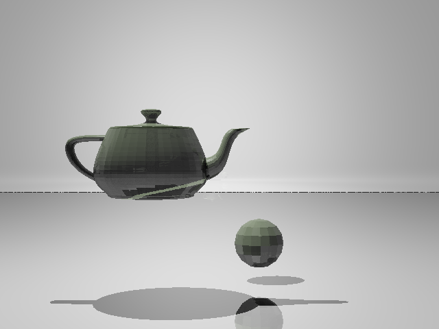
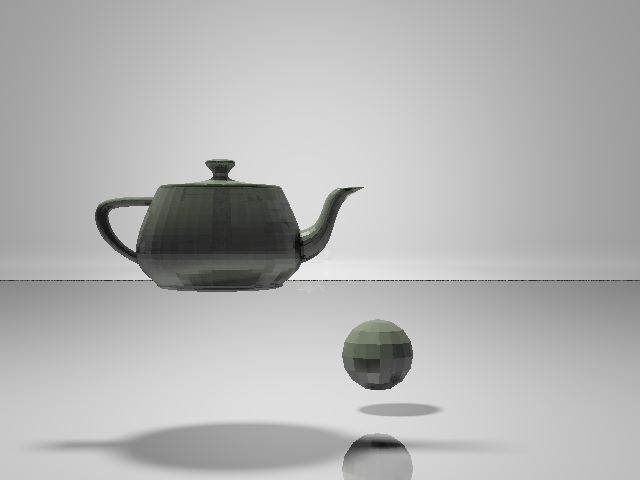
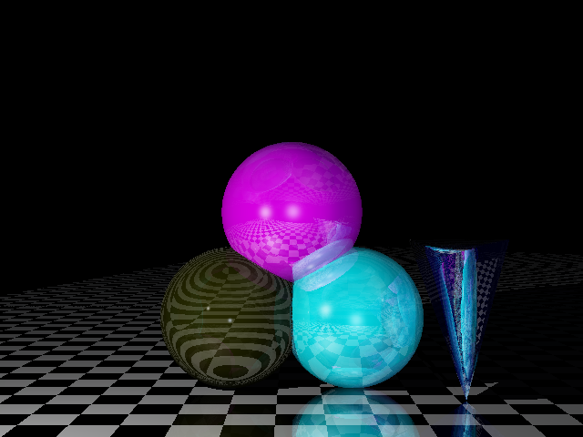
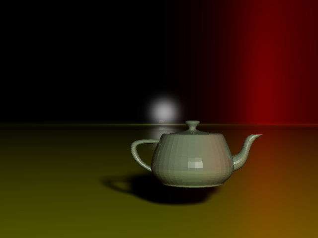
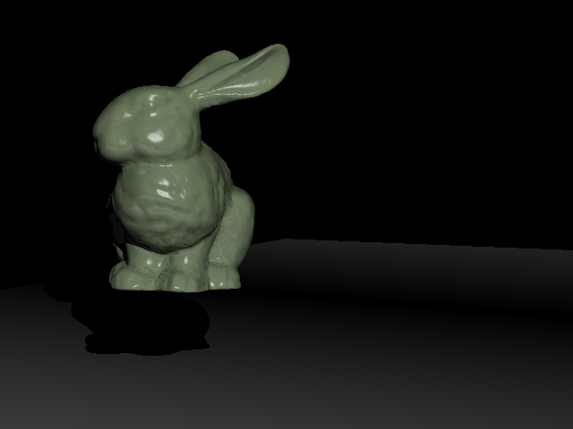
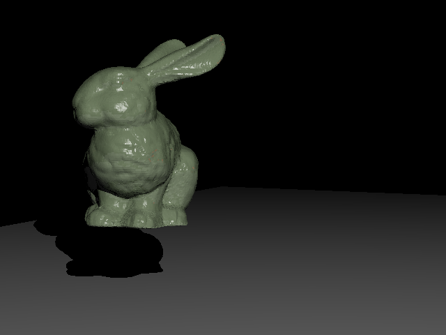
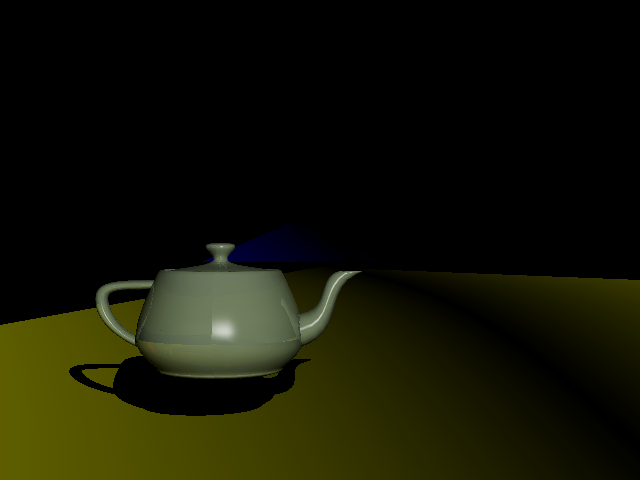
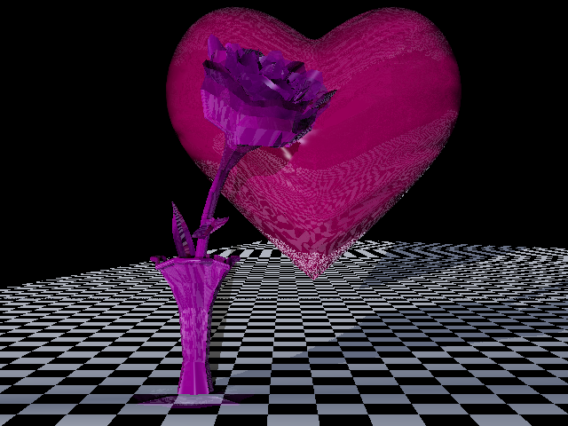
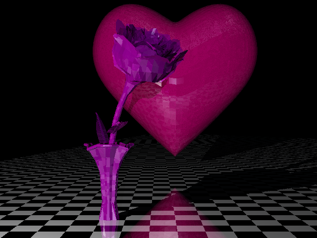

# naive-ray-tracing
A naive ray tracing for VR final project

Implementd soft-shadow, transparency, half-transparency and color-bleeding.

Besides, also implementd the gouraud shading, which makes the objects more vivid than flat shading.

## Requirements
- opencv 2.4.2
- This project is build under g++ 4.9.
- Jsonxx
- OptionParse

where `Jsonxx` is used to load json file decribing the scene and `OptionParse` is used to handle the project options. And I have already provided the source code in the project.

## Usage
`make`

`./ray-tracing input_scene.json output_pic.png [options list]`

Here is the option args:

- `--width  = [int] default = 640`
- `--height = [int] default = 480`
- `--distance = default = 10000  where define the distance between the viewpoint and the picture`
- `--epsion = [float] default = 0.01 stop tracing the ray whose intensity reaches or go above that epsion`
- `--soft = [int] default = 0 whether use softshadow, 1 means use and 0 means not use`
- `--radius = [int] default = 4 the radius of the sampling sphere`
- `--ratio = [double] default = 0.75 the sampling rate`
- `--diffuse_num = [int] default = 0 the number of diffused ray, it may cost too much reandering time if too large`

You could define the scene yourself in a `.json` file and here is the options args.

- `lights` have **color** and **point** property. **Point** means the postion of the light source.
- `objects` have **Body** and **GridSurface** property. **Body** is the object loaded from a obj file, **GridSurface** is the surface instance we use three point to define a plane.

Some specific args you could refer to the example json file `teapot.json`.

Here is some pictures for display.

Because of the cost of reandering, I am sorry I couldn't render every picture with soft-shadow.

## Softshadow

Also, softshadow is really expensive to render.

## transparency, half-transparency

## color-bleeding

## gouraud shading

## Acknowledgement

- Thanks Hong Jiang et al. for their `Jsonxx` lib.
- Thanks Johannes Weibl et al. for their `OptionParser` lib.
- Thanks professor and classmates for their help.
